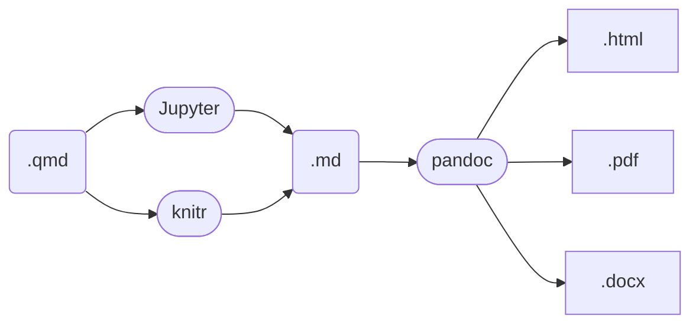
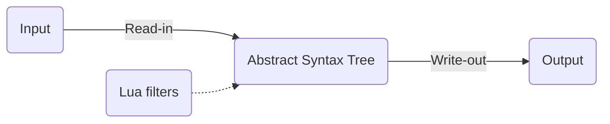

## Overview

This repository contains CL's personal Lua filters for customizing 
the rendered behavior of Quarto documents. Each filter is a
standalone subdirectory containing documentation and Lua code. 

## Background details

### A brief note on Lua

Lua is a lightweight scripting language. In our case, we will be 
using it to write small programs - called "filters" - that get 
executed as a intermediary step when Pandoc converts Markdown code
to different formats.

### What's Pandoc again?

Pandoc is general-purpose document converting engine that can
translate many input formats into many output formats. Although
Pandoc supports many formats, the most common workflows are to
convert markdown (`.md`) syntax (written as plain text) into HTML
(`.html`), PDF (`.pdf`), and Microsoft Word (`.docx`) files. 

### What's Quarto's role in all of this?

Quarto (like `Rmarkdown` before it) is the user interface for 
interweaving data science code with outputs, narrative, equations,
flowcharts, and more to generate a reproducible research document.
Quarto documents have the file extension `.qmd`; they get 
translated to plain markdown before Pandoc takes care of the rest 
(see below).



### Okay then, what's Lua for?

Sometimes Quarto doesn't have your desired built-in features. Lua 
filters are the recommended way for users to extend Quarto
functionality, and pandoc more generally. Pandoc is included in 
Quarto installations - and Pandoc internally supports Lua - so user
extensions can be made without downloading any extra software. 

Pandoc works by reading an input file, parsing a markdown file 
into an "Abstract Syntax Tree" (AST), then writing into the output 
format. Lua filters change the structure of the AST. 




## This repository

### What is this repository?

Quarto is new enough that there are not many community-driven 
solutions for desired functionality. Also, basic documentation for 
writing Lua filters aimed at newbies (like me) is a little 
lacking. My intention is that this will be space for me to collect 
useful extensions as well as compile things that I learn over time.

### What's in the files?

Each Lua filter will be placed in its own subdirectory. These 
subdirectories contain a README file explaining what the extension
is for, Lua code that implements the extension, and an example 
use-case in the form of a `qmd` file.

### How do I use the filters?

Simply place a filepath pointing to the `.lua` file in the YAML of 
your target Quarto document. Suppose I have a filter named 
`cool-feature.lua` that makes my Quarto output better. Simply 
include a line pointing to the location of this file in the YAML 
of said document like so:

> filters: 
> 
> &nbsp;&nbsp; - cool-feature

### How do I write new filters?

It's tricky. 

1. Have some issue that isn't solved by Quarto's base functionality. This is the easy part.
2. Create a new directory to house new feature
   1. open terminal
   2. navigate to directory to store this new feature (I have a folder called `.lua-filters`)
   3. Execute the following code. You will be prompted to name the new feature; this command will create a `.lua` file, a README, a `.gitignore`, a `.yml` file, and an example `.qmd` document.

```
quarto create extension filter
```
3. Add Lua code to the `.lua` file using desired text editor. This is the tricky part. Helpful strategies include
   -  Use the `example.qmd` to develop your Lua code. Make changes to that file to test the changes to your Lua code. Render the example to see if your Lua code makes the desired changes.
   -  Print the Abstract Syntax Tree; knowing what the AST looks like will be key in knowing how to alter its structure to obtain the desired output. This can be done by using Pandoc to convert the `.qmd` file to a `.json` with the following shell command, then reading the `.json` file into R and printing the AST:

**Terminal:**
```
pandoc -f markdown -t json -o example.json example.qmd
``` 

**R:**
```
xfun::tree(
  jsonlite::fromJSON('example.json', simplifyVector = FALSE)
)
```

4. Document what the filter does in the `README.md` file, then illustrate a use case with an `example.qmd`.  
5. Push subdirectory to `clroberts-adfg/lua-filters`


### Where can I learn more?

Generally speaking, Pandoc's Lua documentation is much more 
helpful than Lua's own help files. This is because Pandoc's 
documentation is written with this specific usage in mind.
Also, Pandoc includes external Lua libraries on top of the
base language; thus Pandoc documents useful functions that 
may not necessarily be part of standard Lua. 

That being said:
- there is a nice overview on general Lua syntax [here](https://learnxinyminutes.com/docs/lua/).
- The Quarto website has a handy reference for what Lua filters are and [how to use them](https://quarto.org/docs/extensions/filters.html) in a `.qmd` document, as well as more detailed information for how to [learn and develop](https://quarto.org/docs/extensions/lua.html) Lua code.
- The [Pandoc Lua filters](https://pandoc.org/lua-filters.html) documentation should be regarded as the primary reference for writing Lua filters.
- Once you've gotten somewhat comfortable writing Lua code and just need reminders as you go, you may find this [quick reference](https://quarto.org/docs/extensions/luarefv51.pdf) handy, and
- the [Lua reference manual](https://www.lua.org/manual/5.3/) is the comprehensive guide to the language and base library.
